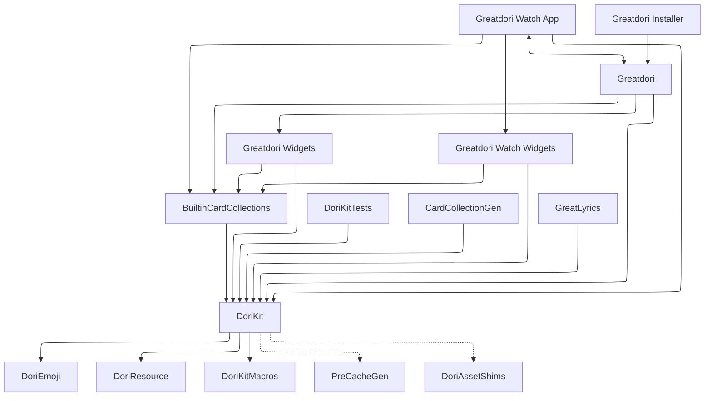

<picture>
  <source media="(prefers-color-scheme: dark)" srcset="Artwork/IconWithText~dark.png">
  
</picture>
<br />
<br />
<picture>
  <source media="(prefers-color-scheme: dark)" srcset="Artwork/DoriKitIconWithText~dark.png">
  
</picture>

# Greatdori!

Greatdori includes DoriKit library, iOS app and watchOS app.
DoriKit allows you to fetch data from Bestdori API in Swifty way:
you can get raw data from the API,
or let DoriKit to process data from the API for you.
Apps in this project show you how to use the DoriKit,
and provide native experience to Bestdori.

## Using DoriKit
### Xcode Project (Recommended)
1. Clone this project into your project folder:
    ```sh
    git clone https://github.com/WindowsMEMZ/Greatdori.git
    ```
    Use `git submodule` if you want to manage versions better.
2. Update submodules for Greatdori! project:
    ```sh
    cd Greatdori
    git submodule update --init --recursive
    ```
3. Install CMake if you don't have:
    ```sh
    brew install cmake
    ```
4. Drag `Greatdori.xcodeproj` and drop it into the project navigator in Xcode.
5. Go to project editor for your project, select a target,
    add DoriKit in *Frameworks, Libraries and Embedded Content* section.
    
> [!TIP]
> The ABI of DoriKit is stable between release versions
> when using with the Xcode Project.

### XCFramework
Download the `DoriKit.xcframework` from
[releases](https://github.com/WindowsMEMZ/Greatdori/releases/latest)
then link it to your project.

Or you can build an XCFramework by your own as described
in the [Build XCFramework](#build-xcframework) section.

### Swift Package Manager
Add the following dependency to your `Package.swift` file:

```swift
.package(url: "https://github.com/WindowsMEMZ/Greatdori.git", branch: "main"),
```

Then add the dependency to targets you're going to use it:

```swift
.target(
    name: "MyTarget", 
    dependencies: [
        .product(name: "DoriKit", package: "Greatdori"),
    ]
),
```

> [!NOTE]
> Some features may not available if you're using DoriKit
> with Swift Package Manager. Always import it as a Xcode project
> by the steps described in [Xcode Project](#xcode-project-recommended) section when possible.
> See the next section to learn more about limited features.

### Features that are not available with Swift Package Manager
- **Not available**: [Pre-Cache](#pre-cache).
- **Not available**: Rich content related APIs.
    Features that contain rich contents are also not availble,
    such as `DoriAPI.Post`.
- **Not available**: Built-in binary resources. APIs that use these resources
    will get them online instead.
- **Not available**: Offline asset APIs.

## Building
Xcode 26.0 and Swift 6.2+ is required for building this project.

CMake is required for building from Xcode Project,
you can install it by Homebrew if you don't have one:

```sh
brew install cmake
```

Open `Greatdori.xcodeproj`, then select a scheme you want to build.
You can also use `swift build` to build DoriKit from Package.swift.
However, functionality of DoriKit is limited if it's built as a Swift Package.

### Build XCFramework
An XCFramework allows you to use DoriKit in your project easily.
Generally, we attach a `DoriKit.xcframework` with each releases.
You can build a XCFramework of DoriKit by your own using `build-xcframework`
script like the following:

```sh
$ ./BuildTool/build-xcframework
```

Once the build succeeded, you can find `DoriKit.xcframework` in the `build/` folder.

### Schemes
There're several schemes in Greatdori! project:

- **Greatdori**: The Greatdori! app for iOS, iPadOS and macOS;
- **Greatdori Widgets**: Widget extension for **Greatdori** scheme;
- **Greatdori Watch App**: The Greatdori! app for watchOS;
- **Greatdori Watch Widgets**: Widget extension for **Greatdori Watch App** scheme;
- **BuiltinCardCollections**: Built-in card collection for widgets;
- **DoriKit**: The DoriKit framework;
- **DoriAssetShims** Objective-C shims for offline asset features in DoriKit;
- **DoriKitMacros**: Implementations of macros in DoriKit;
- **DoriKitTests**: Tests for DoriKit;
- **DoriEmoji**: Emoji collections for community UI of DoriKit;
- **DoriResource**: Commonly used binary resources for DoriKit;
- **Greatdori Installer**: Generates a `pkg` installer for macOS app;
- **CardCollectionGen**: A CLI tool which generates built-in card collections;
- **GreatLyrics**: A tool for making lyrics file of songs.
- **libgit2**: LibGit2 and its dependencies, required for *DoriAssetShims*.

Besides, some targets have a corresponding *Without Pre-Cache* scheme,
which builds the target without [pre-cache](#pre-cache) for DoriKit.

### Pre-Cache
To make it faster to get some data which is updated less frequent,
DoriKit generates a `PreCache.cache` file in **compile-time**
and embeds it to `DoriKit.framework` bundle. This allows you to get some information
like character list from `DoriCache.preCache` without performing a network request.

Pre-Cache generation happens when you first build DoriKit for a configuration,
after you cleaned build folder, or if the previous generation date was over a week ago.
If you're experiencing a poor network connection
that makes you can't generate pre-cache successfully,
you can opt-out it by building your target from `Without Pre-Cache` scheme.

### Code Signing
All development teams of each targets are set to `Yuxuan Chen (8CZ4JT4F3M)`
which makes it easier for our CI runs and distribution workflows.
You have to change it to your own team before building,
or choose *None* if you build it only for simulator or macOS.
(And don't forget to change it back if you'd like to open a pull request!)

## Contributing to Greatdori!
Contributions to Greatdori! are welcomed and encouraged!
Fork the project, make changes and open your pull requests!

If you're experiencing some bugs, or have any suggestion to Greatdori!,
filing an issue for it is also welcomed.

### `Greatdori.xcodeproj` & `Package.swift`
`Greatdori.xcodeproj` is the main project file of Greatdori!,
we suggest you to open this project file in Xcode to make changes to Greatdori!.

`Package.swift` makes it easier to embed DoriKit in other projects,
and should not be used for editing code of Greatdori!,
because `xcodeproj` file maintains structures of all files in this project.

### Targets Relationship


### About GYB Source Files
You may note that some source files have suffix `.swift.gyb` instead of `.swift`,
this kind of files are GYB templetes. GYB is a useful tool from the swiftlang project
which enables you to generate repeated source code from less code.

<details><summary>Usage of GYB</summary>

```

usage: gyb [-h] [-D NAME=VALUE] [-o TARGET] [--test] [--verbose-test] [--dump]
           [--line-directive LINE_DIRECTIVE]
           [file]

Generate Your Boilerplate!

positional arguments:
  file                  Path to GYB template file (defaults to stdin)

options:
  -h, --help            show this help message and exit
  -D NAME=VALUE         Bindings to be set in the template's execution context
  -o TARGET             Output file (defaults to stdout)
  --test                Run a self-test
  --verbose-test        Run a verbose self-test
  --dump                Dump the parsed template to stdout
  --line-directive LINE_DIRECTIVE
                        Line directive format string, which will be provided 2
                        substitutions, `%(line)d` and `%(file)s`. Example:
                        `#sourceLocation(file: "%(file)s", line: %(line)d)`
                        The default works automatically with the `line-
                        directive` tool, which see for more information.

    A GYB template consists of the following elements:

      - Literal text which is inserted directly into the output

      - %% or $$ in literal text, which insert literal '%' and '$'
        symbols respectively.

      - Substitutions of the form ${<python-expression>}.  The Python
        expression is converted to a string and the result is inserted
        into the output.

      - Python code delimited by %{...}%.  Typically used to inject
        definitions (functions, classes, variable bindings) into the
        evaluation context of the template.  Common indentation is
        stripped, so you can add as much indentation to the beginning
        of this code as you like

      - Lines beginning with optional whitespace followed by a single
        '%' and Python code.  %-lines allow you to nest other
        constructs inside them.  To close a level of nesting, use the
        "%end" construct.

      - Lines beginning with optional whitespace and followed by a
        single '%' and the token "end", which close open constructs in
        %-lines.

    Example template:

          - Hello -
        %{
             x = 42
             def succ(a):
                 return a+1
        }%

        I can assure you that ${x} < ${succ(x)}

        % if int(y) > 7:
        %    for i in range(3):
        y is greater than seven!
        %    end
        % else:
        y is less than or equal to seven
        % end

          - The End. -

    When run with "gyb -Dy=9", the output is

          - Hello -

        I can assure you that 42 < 43

        y is greater than seven!
        y is greater than seven!
        y is greater than seven!

          - The End. -

```

</details>

### Testing
You have to run testing by `DoriKitTests` scheme in Greatdori.xcodeproj (instead of Package.swift).

## License
This project is licensed under the Apache License 2.0. See the [LICENSE](LICENSE.txt) file for details.
