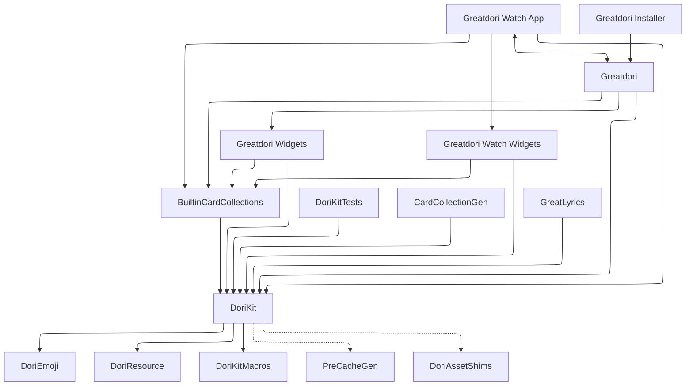

<picture>
  <source media="(prefers-color-scheme: dark)" srcset="Artwork/IconWithText~dark.png">
  
</picture>

# Greatdori!

Greatdori includes iOS, macOS and watchOS app,
built with [DoriKit](https://github.com/Greatdori/DoriKit)

| **Target** | **Status** |
|---:|:---:|
| Greatdori           | |
| Greatdori Watch App | |

## Building
Xcode 26.0 and Swift 6.2+ is required for building this project.

CMake is required for building from Xcode Project,
you can install it by Homebrew if you don't have one:

```sh
brew install cmake
```

First, create a directory for the Greatdori! project:

```sh
mkdir Greatdori
cd Greatdori
```

Then clone this project by Git:

```sh
git clone https://github.com/Greatdori/Greatdori.git
cd Greatdori
```

Note that there should be two `Greatdori` folders,
your current path like this:

```sh
$ pwd
/path/to/Greatdori/Greatdori
```

Use the `utils/update-checkout` script to checkout all repositories
that Greatdori! needs. Add `--clone` option for the first time
to clone all repositories:

```sh
utils/update-checkout --clone
```

After cloning all repositories needed, use `utils/generate-workspace`
to generate a `xcworkspace` for building project:

```sh
utils/generate-workspace
```

Open `Greatdori.xcworkspace`, then select a scheme you want to build.

### Schemes
There're several schemes in Greatdori! project:

- **Greatdori**: The Greatdori! app for iOS, iPadOS and macOS;
- **Greatdori Widgets**: Widget extension for **Greatdori** scheme;
- **Greatdori Watch App**: The Greatdori! app for watchOS;
- **Greatdori Watch Widgets**: Widget extension for **Greatdori Watch App** scheme;
- **BuiltinCardCollections**: Built-in card collection for widgets;
- **Greatdori Installer**: Generates a `pkg` installer for macOS app;
- **CardCollectionGen**: A CLI tool which generates built-in card collections;
- **GreatLyrics**: A tool for making lyrics file of songs.

Besides, some targets have a corresponding *Without Pre-Cache* scheme,
which builds the target without [pre-cache](#pre-cache) for DoriKit.

### Pre-Cache
To make it faster to get some data which is updated less frequent,
DoriKit generates a `PreCache.cache` file in **compile-time**
and embeds it to `DoriKit.framework` bundle. This allows you to get some information
like character list from `DoriCache.preCache` without performing a network request.

Pre-Cache generation happens when you first build DoriKit for a configuration,
after you cleaned build folder, or if the previous generation date was over a week ago.
If you're experiencing a poor network connection
that makes you can't generate pre-cache successfully,
you can opt-out it by building your target from `Without Pre-Cache` scheme.

### Code Signing
All development teams of each targets are set to `Yuxuan Chen (8CZ4JT4F3M)`
which makes it easier for our CI runs and distribution workflows.
You have to change it to your own team before building,
or choose *None* if you build it only for simulator or macOS.
(And don't forget to change it back if you'd like to open a pull request!)

## Contributing to Greatdori!
Contributions to Greatdori! are welcomed and encouraged!
Fork the project, make changes and open your pull requests!

If you're experiencing some bugs, or have any suggestion to Greatdori!,
filing an issue for it is also welcomed.



## License
This project is licensed under the Apache License 2.0. See the [LICENSE](LICENSE.txt) file for details.
